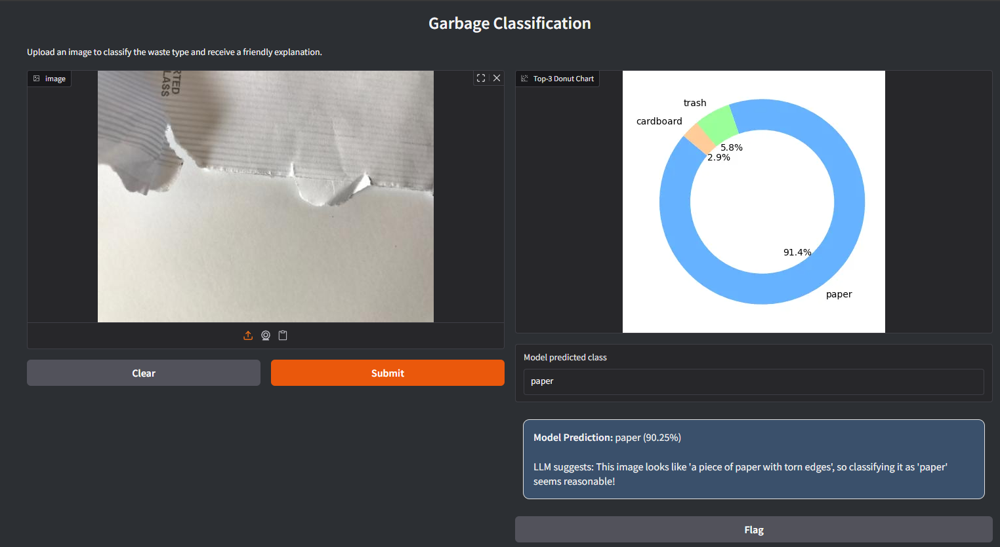
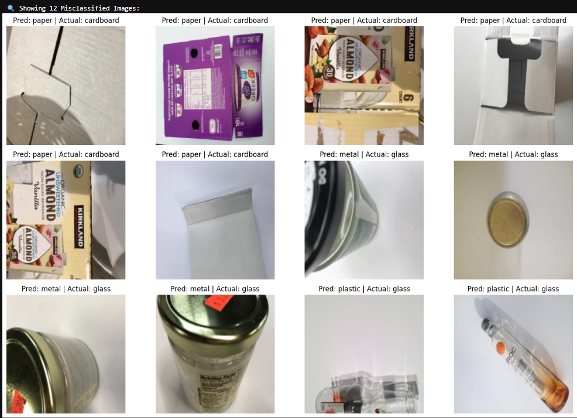

# 🗑️ Garbage Classification using ResNet50 & Gradio

This project implements an **AI-powered garbage classification system** using **transfer learning with ResNet50**.  
The system can classify images of waste into **6 categories**:

**`cardboard` | `glass` | `metal` | `paper` | `plastic` | `trash`**

Additionally, a **Gradio-based UI** is provided for easy image upload and real-time classification with top‑3 confidence scores.

---

## 📂 Project Structure

GARBAGE-CLASSIFICATION/
│
├── app/ # Optional UI-specific Python modules
├── demo_images/ # Screenshots for README
│ └── AppScreenshot.png
├── images/ # Sample images for testing
│ ├── cardboard1.jpg
│ ├── glass1.jpg
│ └── ...
├── models/ # Saved model weights
│ └── best_garbage_model.pth
├── notebooks/ # Jupyter notebooks for training & evaluation
│ └── Garbage_Classification_ResNet50.ipynb
├── src/ # Source code (training, preprocessing, utils)
│ ├── app.py # Gradio app entry point
│ └── predict.py # Image prediction helper functions
├── requirements.txt # Python dependencies
├── README.md # Project documentation
└── .gitignore # Ignore cache, logs, env, etc.


---

## ⚡ Features

1. **Deep Learning with Transfer Learning**  
   - Uses **ResNet50** pre-trained on ImageNet.  
   - Two-phase training: **Feature Extraction → Fine-Tuning**.  
2. **High Accuracy on 6 Waste Classes**  
   - Achieved **86.72% test accuracy** with macro F1-score of 0.87.  
3. **Real-Time Inference**  
   - Gradio UI provides **Top‑3 confidence predictions** for new images.  
4. **Visual Insights**  
   - Confusion matrix and misclassified images for model analysis.  

---

## 🖼️ Model Workflow



---

## 📊 Results

### **Training & Validation Performance**

- Training stabilized at ~**0.78–0.80 accuracy** after 20 epochs  
- Smooth loss curve, low overfitting due to data augmentation & early stopping  

| Metric                  | Score  |
|-------------------------|--------|
| **Final Test Accuracy** | 86.72% |
| **Macro F1-score**      | 0.87   |
| **Weighted F1-score**   | 0.87   |

---

### **Sample Misclassified Images**

<p align="center">

</p>

- **Cardboard → Paper**: Often occurs for folded or printed cardboard  
- **Glass → Metal**: Glass jars with metallic lids reflect light like metal  
- **Trash**: Most challenging due to few samples (22 images)

---

### **Inference on New Images (Top‑3 Confidence)**

<p align="center">

</p>

- High-confidence Top‑1 predictions (>89%) for clear cases  
- Correct class appears in Top‑3 even in ambiguous cases  
- Suitable for **smart bin** or **waste sorting system** applications

---

## 🏗️ How to Run

### **1️⃣ Clone the Repository**

```bash
git clone https://github.com/YourUsername/Garbage-Classification.git
cd Garbage-Classification

```

### 2️⃣Create and activate a virtual environment (Optional):

```bash
python -m venv venv
# macOS/Linux
source venv/bin/activate
# Windows
venv\Scripts\activate
```

### 3️⃣Install dependencies:

```bash
pip install -r requirements.txt
```

### 4️⃣ Run Gradio App:

```bash
python app.py
```
---
Gradio will launch a local server and provide a link for the web interface.


---

## 🧠 Lessons Learned & Challenges

1. **Overfitting during Early Experiments**
   - Initial models overfitted quickly due to the small dataset  
   - **Solution:** Added data augmentation, early stopping, and fine-tuning only top ResNet blocks

2. **Visual Similarity between Classes**
   - Cardboard vs Paper and Glass vs Metal are the most confusing pairs

3. **Small Dataset for Trash Class**
   - Lower representation (22 samples) caused some misclassifications

---

## ✨ Future Improvements

- Add more data for **underrepresented classes** like Trash
- Use **Progressive Fine-Tuning** and **Test-Time Augmentation (TTA)**
- Deploy to **smart bins / IoT** with PyTorch Mobile or TensorRT

---

## 📜 License

This project is licensed under the **MIT License**.  
Feel free to use and adapt it for academic or commercial purposes.

---


---

## 🌐 Author & GitHub

**Developed by:** **Your Name**  

📂 **GitHub Repository:** [Click Here](https://github.com/9eek9/garbage-classification)

---

